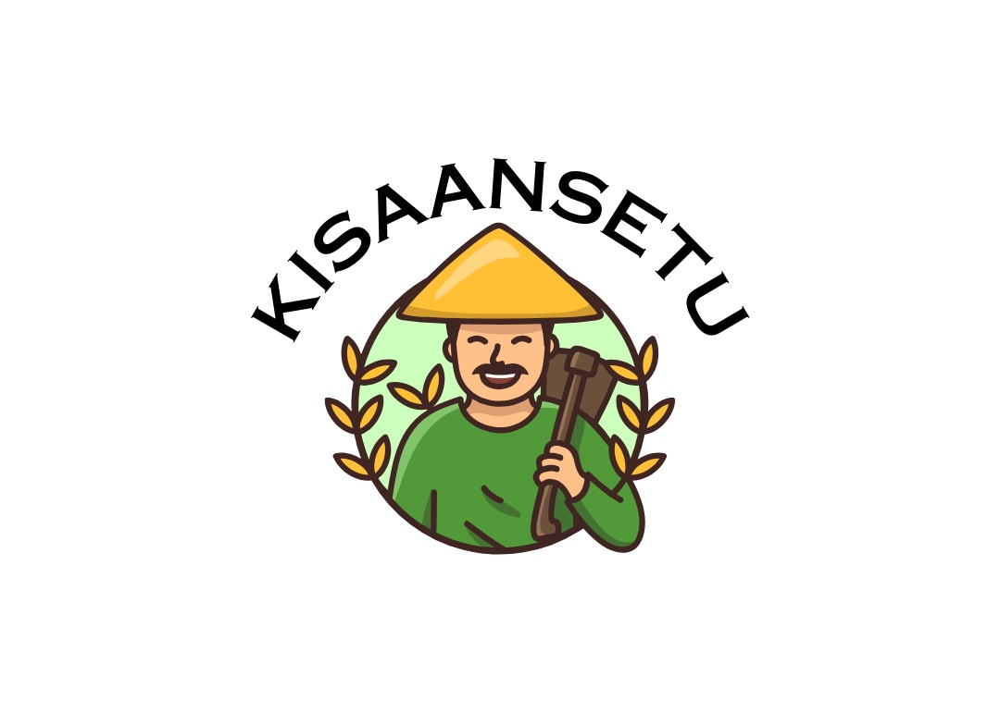

# 🌾 KisaanSetu - AI-Powered Multilingual Platform for Farmers



## 🏆 1st Prize Winner - Agri-Tech Hackathon 2025
KisaanSetu emerged victorious, claiming 1st Place at the Agri-Tech Hackathon hosted by KJ Somaiya College of Engineering, Vidyavihar. Our team "Stranger Strings" competed against 1200+ brilliant minds from across India, winning ₹1,00,000 as prize money during the 24-hour offline hackathon!

## 🚀 Overview
KisaanSetu is a comprehensive, AI-powered mobile platform designed to empower Indian farmers with cutting-edge technology. Our solution addresses multiple challenges faced by farmers through an all-in-one application with 10+ integrated features. The app is built with inclusivity at its core, supporting 8+ Indian languages to reach farmers across diverse linguistic regions.

## 💡 Key Features

### 🗣️ Multilingual Support (8+ Indian Languages)
- English, Hindi, Punjabi, Bengali, Tamil, Telugu, Marathi, Gujarati
- Complete UI translation for inclusivity and accessibility

### 🤖 AI Voice-Assisted Chatbot
- Interactive agricultural assistant with voice input/output
- Automatic language detection and response in the farmer's preferred language
- Personalized agricultural advice and guidance

### 📊 Government Schemes Dashboard
- Comprehensive database of agricultural schemes and subsidies
- Easy-to-understand information on eligibility and application processes
- Direct links to official resources

### 🔍 Plant Disease Detection
- 90%+ accuracy via ML & image processing
- Camera integration for real-time disease identification
- Actionable remedies and treatment recommendations

### ☁️ Hyperlocal Weather Forecasting
- 5-day precision weather insights
- Location-based forecasting for farm-specific decisions
- Critical agricultural weather parameters (humidity, precipitation, etc.)

### 📈 Live Market Rates
- Real-time pricing data for informed selling decisions
- Trends analysis for major agricultural commodities
- Regional market information

### 🌱 Personalized Crop & Fertilizer Recommendations
- Soil and climate-based crop suggestions
- Optimal fertilizer recommendations
- Yield improvement advice

### 🗺️ Nearby Cold Storages & Dealers
- GPS-enabled mapping of storage facilities
- Contact information for agricultural input dealers
- Distance and route information

### 🛒 Farmer Marketplace
- Platform for direct farmer-to-consumer selling
- Agricultural equipment and supplies marketplace
- Elimination of middlemen for better pricing

### 📰 Daily Agricultural News
- Curated agricultural updates and information
- Weather alerts and seasonal advisories
- New technology and best practices information

### 🎤 Voice-based Controls
- Designed for rural accessibility and low literacy users
- Natural language interaction in multiple languages
- Hands-free operation while working in fields

## ⚙️ Tech Stack
- **Frontend:** Flutter (Cross-platform mobile development)
- **Backend:** Firebase (Authentication, Database, Storage)
- **AI/ML:** TensorFlow, Google Generative AI
- **APIs:** Weather APIs, Agricultural Data APIs
- **Voice Technology:** Speech-to-Text & Text-to-Speech
- **Maps Integration:** Geolocator, Flutter Maps
- **Other:** HTTP, SharedPreferences, Image Processing

## 🔧 Installation & Setup

```bash
# Clone the repository
git clone https://github.com/NikhilSKale/kisaansetu.git

# Navigate to the project directory
cd kisaansetu

# Install dependencies
flutter pub get

# Run the app
flutter run
```

## 👥 Team Stranger Strings
- Atharva Pingale
- Nikhil Kale
- Tanaya Jain
- Arnav Chaudhary
- Varun Rahatgaonkar

## 🌟 Future Vision
We aim to expand KisaanSetu to reach millions of farmers across India, continuously improving our AI algorithms and adding more localized features. Our mission is to bridge the technology gap in agriculture and empower farmers with accessible digital tools.

## 🔗 Connect With Us
Open to collaborations, mentorships, and opportunities in:
- 🌱 Agri-Tech & Rural Innovation
- 📱 AI-Powered Applications
- 📊 Data-driven Impact Solutions
- 🤝 Social Entrepreneurship

## 📝 License
This project is licensed under the MIT License - see the LICENSE file for details.

---

💡 **KisaanSetu: Empowering Farmers, Transforming Agriculture**

#AgriTechRevolution #AIForFarmers #BuildingForIndia #TechWithPurpose
